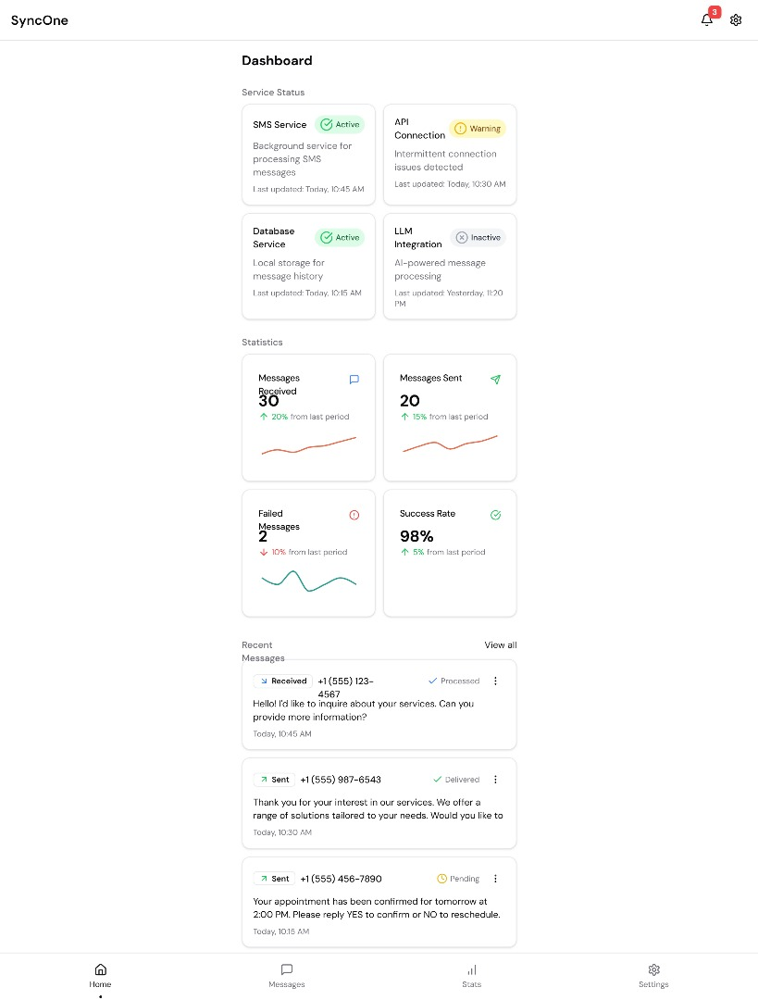
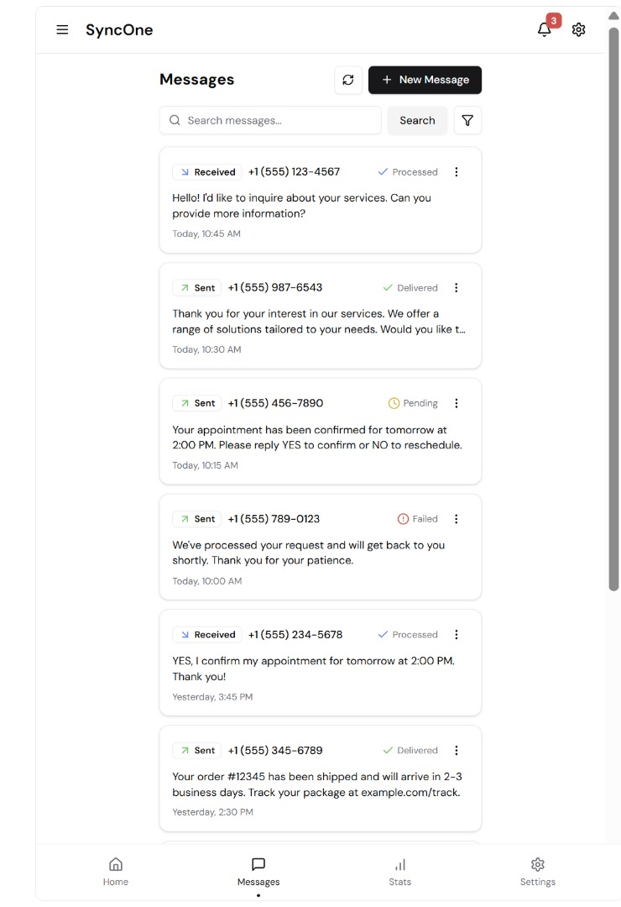
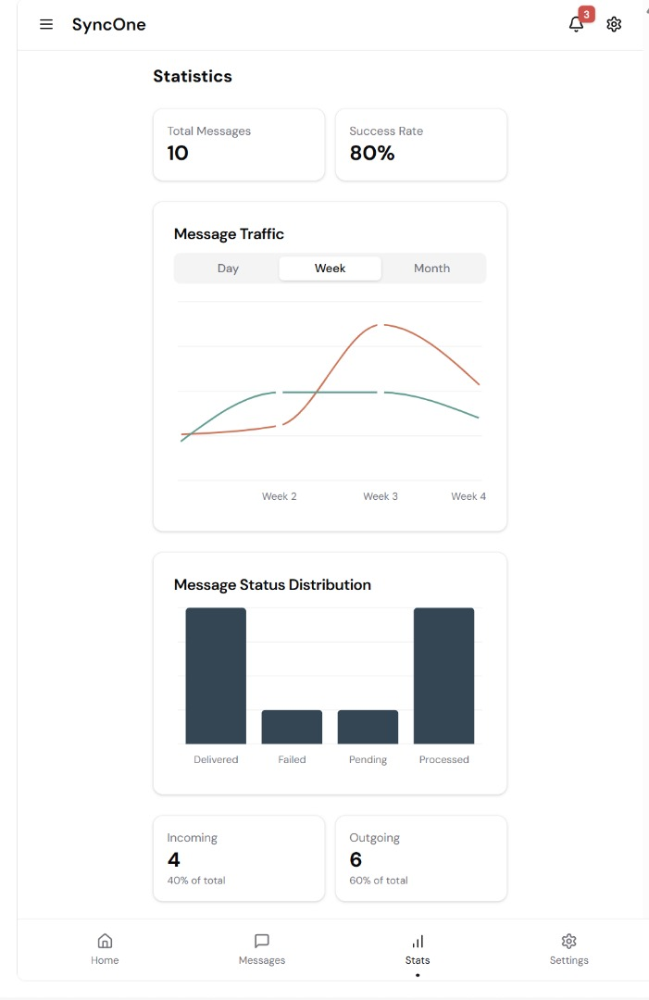
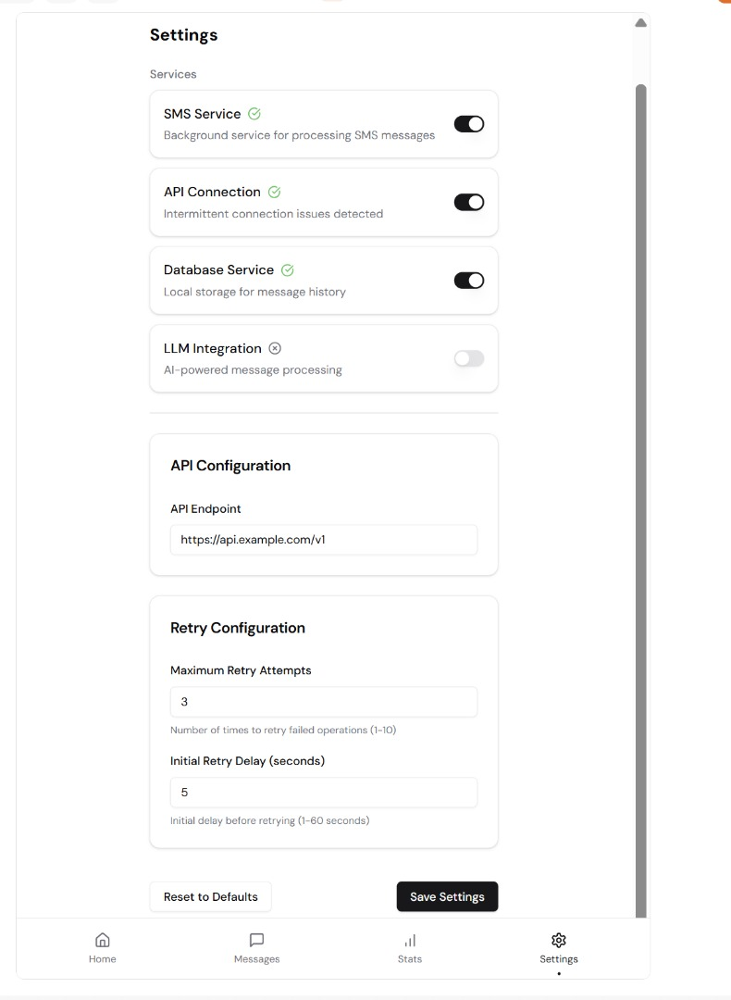

````markdown
# SyncOne

**SyncOne** is a modular and extensible mobile application built with **.NET MAUI** to manage SMS communication and processing in real-time. Designed with an intelligent, background-processing architecture, it supports cross-platform operation and integration with Language Models (LLMs) to enable offline AI-powered messaging.

---

## 📲 Features

- **Real-Time SMS Processing**  
  - Background service (`SmsService`) ensures continuous SMS operations even when the app is closed.  
  - Retry mechanism with exponential backoff for reliable delivery.

- **Platform-Agnostic Design**  
  Uses `ISmsService` as an abstraction layer for SMS operations, enabling cross-platform integration.

- **Extensible Architecture**  
  Modular components like `DatabaseService`, `ApiService`, and `ConfigurationService` promote maintainability and scalability.

- **Intelligent Integration**  
  Supports LLM-powered interactions—AI assistants, translation, customer support via SMS.

---

## 🧠 Use Cases

### SMS-based LLM Interactions

- AI assistants via SMS  
- Offline language translation or tutoring  
- Educational content delivery in remote areas  
- SMS-based customer support automation

### Other Scenarios

- Remote data collection in low-connectivity areas  
- Two-factor authentication SMS parsing  
- Automated autoresponders  
- Bulk alerts and notifications

---

## 🧰 Prerequisites

1. **Development Environment**  
   - Visual Studio 2022 or later with the MAUI workload  
   - .NET 8.0 SDK or later  
   - Android SDK (API level 21 or higher)

2. **Android Permissions**  
   Add to `Platforms/Android/AndroidManifest.xml`:
   ```xml
   <uses-permission android:name="android.permission.SEND_SMS"/>
   <uses-permission android:name="android.permission.RECEIVE_SMS"/>
   <uses-permission android:name="android.permission.READ_SMS"/>
````

3. **Dependency Injection**
   Ensure DI setup (e.g., Microsoft.Extensions.DependencyInjection) for services like `ISmsService`.

---

## 🚀 Setup & Installation

1. **Clone the repository**

   ```bash
   git clone https://github.com/yourusername/SyncOne.git
   cd SyncOne
   ```

2. **Open the project**
   Use Visual Studio to open the solution file.

3. **Restore & register dependencies**

   ```bash
   # NuGet restore happens automatically in VS
   ```

   In your DI registration (e.g. `MauiProgram.cs`):

   ```csharp
   services.AddSingleton<ISmsService, AndroidSmsService>();
   services.AddSingleton<DatabaseService>();
   services.AddSingleton<ApiService>();
   services.AddSingleton<ConfigurationService>();
   ```

4. **Build & deploy**
   Deploy to an Android device or emulator via Visual Studio.

---

## ⚙️ Configuration

* Uses a local **SQLite** database for storage.
* App settings can be modified from the in-app configuration UI.

---

## 🧱 Project Structure

```
Models/                      → Data models  
Services/                    → Core logic & integrations  
ViewModels/                  → MVVM view models  
Platforms/Android/           → Android-specific code & permissions  
Platforms/Android/Services/  → Android SMS service implementation  
```

---

## 📸 Screenshots

UI screens from the SyncOne dashboard (place your `.png` files in `screenshots/` at repo root):

### Home



### Messages



### Stats



### Settings



---

## 🤝 Contributing

Contributions are welcome!

1. Fork the repo
2. Create a feature branch

   ```bash
   git checkout -b feature/your-feature-name
   ```
3. Commit your changes

   ```bash
   git commit -m "Add your feature"
   ```
4. Push to your branch

   ```bash
   git push origin feature/your-feature-name
   ```
5. Open a Pull Request

---

## 👨‍💻 Authors

* **Telli Koroma**
* **Dennis Stephens**

---

## 📄 License

This project is licensed under the **MIT License**. See [LICENSE](LICENSE) for details.

---

## 📬 Contact

* **Email:** [tellikoroma@gmail.com](mailto:tellikoroma@gmail.com)
* * **Email:** [kamaradennis36@gmail.com](mailto:kamaradennis36@gmail.com)
* **GitHub Issues:** [SyncOne Issues](https://github.com/Telli/SyncOne/issues)

```
```
